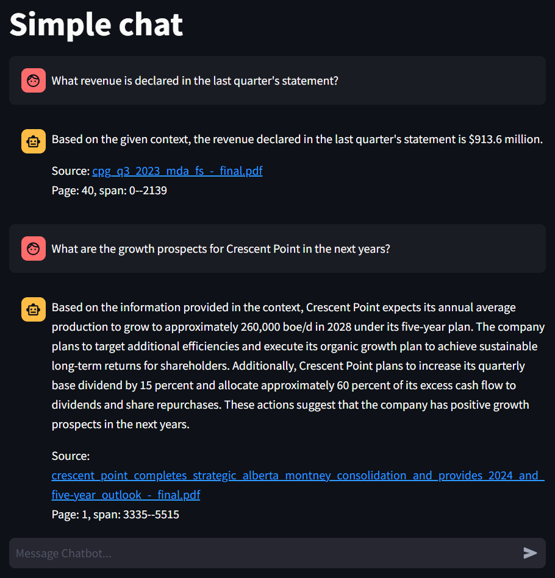
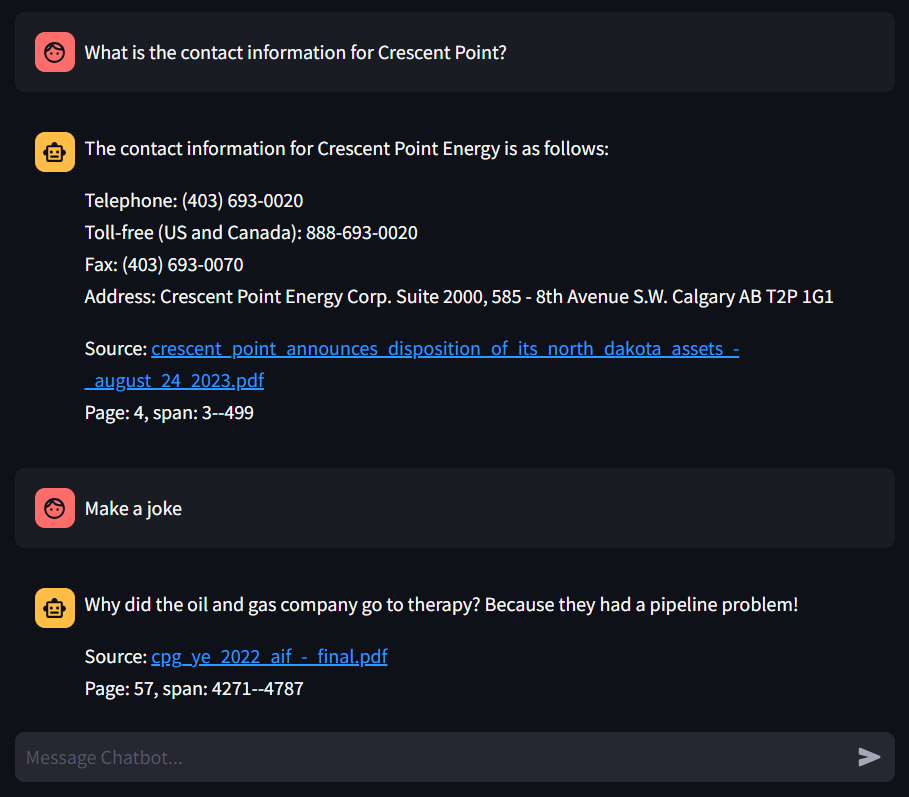
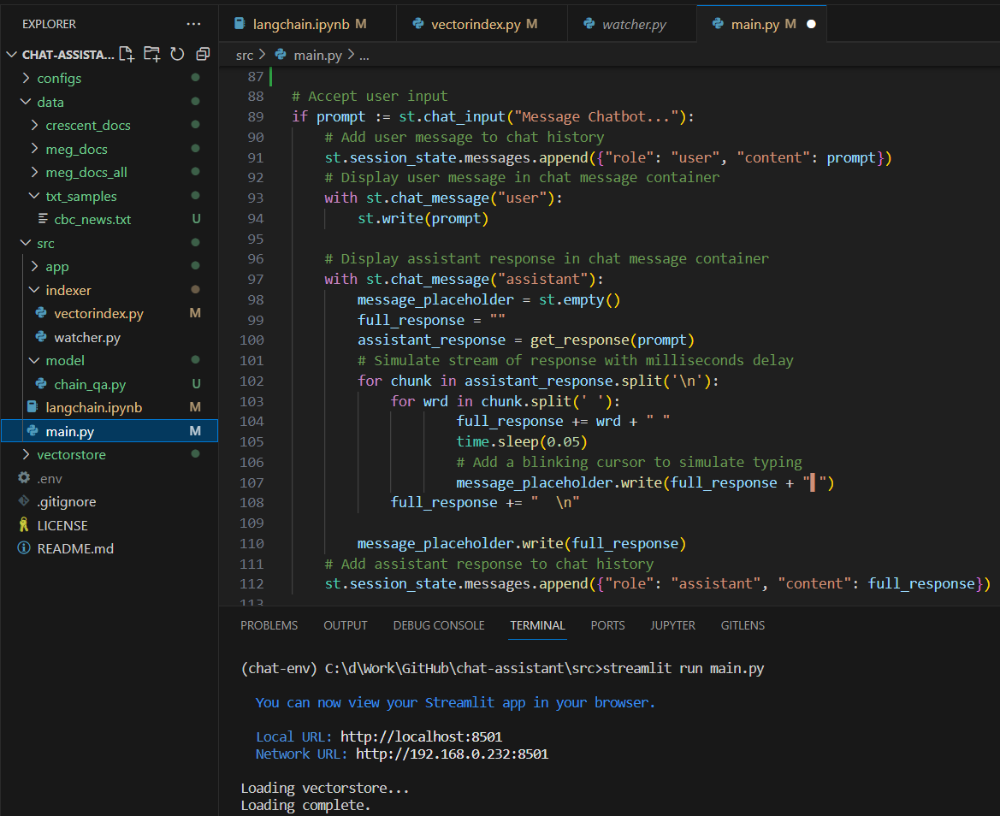

# Chat Assistant for Document Analysis and QA

 

This repository contains the code for a chat assistant to help you analyze your data in any format (PDF, DOCX, TXT).

This project is implemented with the LangChain API, OpenAI models for embedding and response generation, ChromaDB for vector storage, and Streamlit for the frontend app.

You can easily switch from the OpenAI API to any LLM model and run your application locally.

## ToDo List

- [x] Build Mantainable Vector Database
- [x] Question Answering
- [ ] Document Summarization
- [ ] Multi-turn Conversation
- [ ] Remove Unused Sources
- [ ] Release Code
- [ ] Release Installation Instrctions

## Demo

Chat examples

Small code snippet

